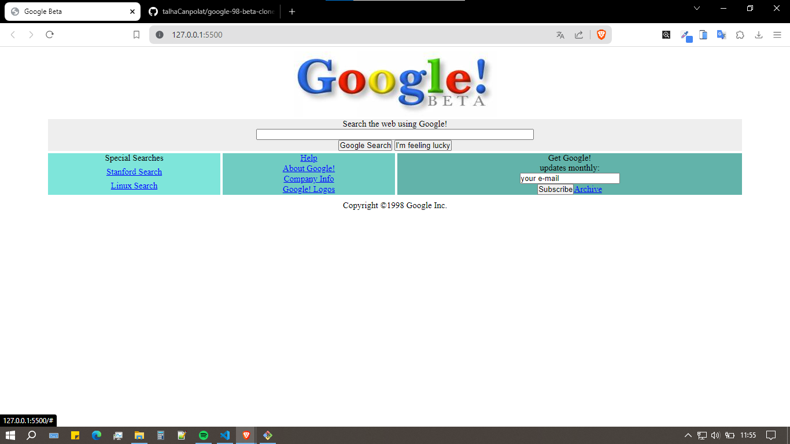

# 98 Google Beta
Bu proejde patika dev platformu üzerinde bulunan css 2.ödev konusu olan 1998 google betası yapıldı. Kodlar günümüz kodlarıyla yazıldı

**Not:**  Table center gibi yapılar yerine günümüzde daha yaygın olan kodları (flex yapısı) kullanmayı tercih ettim.

